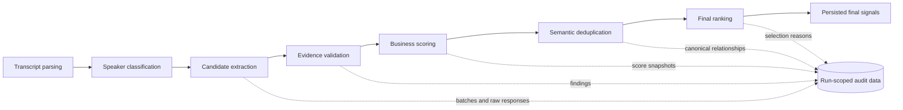

# SignalBridge

SignalBridge turns recruiting transcripts into grounded business decision signals. It identifies advisor-side drivers and blockers, preserves exact evidence, exposes uncertainty, and records each analysis as an auditable run.

## Business problem

Important preferences, concerns, dependencies, and commitments are easy to miss in long conversations. SignalBridge gives reviewers a concise set of ranked decision factors without presenting model interpretation as deterministic fact.

## Main features

- UTF-8 plain-text transcript upload with filename, type, and size validation.
- Transcript parsing and speaker-role classification.
- High-recall extraction of grounded, business-relevant candidates.
- Evidence validation with distinct `pass`, `needs_review`, and hard-reject outcomes.
- Fixed-weight business scoring.
- Semantic deduplication with canonical candidates and supporting evidence.
- Preferred-threshold final ranking with a grounded needs-review fallback.
- Exact evidence plus separate adjacent context for referential quotes.
- Immutable analysis runs, raw response and batch persistence, diagnostics, history, and replay validation.
- CSV/JSONL exports and a React review interface.

## Architecture



Backend: FastAPI, SQLAlchemy, PostgreSQL, and pgvector. Frontend: React, TypeScript, Vite, TanStack Query, and React Router. OpenAI model calls are isolated behind structured JSON clients.

## Pipeline stages

1. **Transcript parsing** creates ordered speaker turns.
2. **Speaker classification** identifies advisor and representative ownership.
3. **Candidate extraction** asks whether a grounded statement could explain a business decision. Extraction maximizes grounded recall; greetings, filler, scheduling, small talk, acknowledgements, jokes, and repeats are no-signal.
4. **Evidence validation** verifies traceability, ownership, relevance, and contradiction. It annotates confidence and excludes only hard integrity failures from downstream business processing.
5. **Business scoring** estimates importance using fixed ownership, impact, explicitness, urgency, and evidence-quality weights.
6. **Semantic deduplication** consolidates the same underlying factor while keeping independent effects separate. Explicit decision conclusions become canonical over nearby supporting reasons.
7. **Final ranking** uses preferred thresholds (3.5 explicit, 4.0 implied). If a direction has no qualifying candidate, one highest-ranked grounded `needs_review` candidate may be selected as `best_grounded_fallback`.
8. **Persistence** stores final signals and immutable run-scoped snapshots.

`pass` and `needs_review` remain visibly distinct. No fixed signal quota is imposed, and a driver or blocker is never forced.

## Full analysis versus replay validation

A **full analysis** parses the transcript and performs speaker classification and extraction before validation, scoring, deduplication, and ranking. It creates a new immutable `analysis_run`.

**Replay validation** creates another run from the source run's saved speaker and candidate snapshots. It reruns validation and downstream stages without extraction or speaker-classification calls. The source run is unchanged.

## Backend setup

Requirements: Python 3.11+, Docker Desktop (or PostgreSQL 16 with pgvector), and an OpenAI API key for live analysis.

```powershell
Copy-Item .env.example .env
python -m venv .venv
.\.venv\Scripts\Activate.ps1
python -m pip install --upgrade pip
pip install -r backend\requirements.txt
docker compose up -d db
.\.venv\Scripts\python.exe -m uvicorn backend.app.main:app --reload
```

Startup automatically runs the idempotent schema upgrade and then verifies every required table and column. Check health at `http://127.0.0.1:8000/health`, database health at `/health/db`, and API documentation at `/docs`.

## Frontend setup

```powershell
Set-Location frontend
npm install
npm run dev
```

The frontend defaults to `http://127.0.0.1:8000`. Set `VITE_API_BASE_URL` before starting/building to use another backend.

## PostgreSQL setup

The included Compose service runs PostgreSQL 16 with pgvector and a persistent named volume:

```powershell
docker compose up -d db
docker compose ps
```

For an external database, create a PostgreSQL database, enable the `vector` extension, and set `DATABASE_URL` using the `postgresql+psycopg://` SQLAlchemy form.

## Environment variables

| Variable | Required | Purpose |
|---|---:|---|
| `OPENAI_API_KEY` | Live analysis | OpenAI authentication; never put it in source control. |
| `DATABASE_URL` | Recommended | SQLAlchemy database URL. |
| `APP_ENV` | No | Environment label returned by health checks. |
| `CORS_ORIGINS` | No | Comma-separated trusted frontend origins. |
| `MAX_UPLOAD_MB` | No | Upload limit; default 25. |
| `SPEAKER_CLASSIFIER_MODEL` | No | Speaker model identifier. |
| `CANDIDATE_EXTRACTOR_MODEL` | No | Extraction model identifier. |
| `EVIDENCE_VALIDATOR_MODEL` | No | Validation model identifier. |
| `BUSINESS_SCORER_MODEL` | No | Scoring model identifier. |
| `FINAL_RERANKER_MODEL` | No | Ranking model identifier. |
| `EMBEDDING_MODEL` | No | Deduplication embedding model. |
| `DEDUP_SIMILARITY_THRESHOLD` | No | Existing semantic similarity threshold. |

The local `.env` is ignored. Commit only `.env.example`.

## Database migrations

There is one project-native, idempotent migration module: `backend/migrations/versions/20260719_01_run_scoped_observability.py`. Application startup calls `init_db()`, which creates missing structures, applies additive upgrades/backfills, and runs schema verification. It does not delete transcript history.

Manual verification:

```powershell
.\.venv\Scripts\python.exe backend\scripts\check_local_setup.py
```

Migration/startup failures stop application startup. Schema verification reports exact missing tables or columns.

## Running tests

```powershell
# Full backend
.\.venv\Scripts\python.exe -m pytest backend\app\tests -q

# Frontend type check and production build
Set-Location frontend
.\node_modules\.bin\tsc.cmd --noEmit
npm run build
```

Focused test commands are listed in [docs/PIPELINE_REFERENCE.md](docs/PIPELINE_REFERENCE.md).

## Running a transcript analysis

Start backend and frontend, open `http://localhost:5173`, upload a UTF-8 `.txt` transcript, and select **Run analysis**.

API example:

```powershell
$uploaded = Invoke-RestMethod -Method Post -Uri http://127.0.0.1:8000/api/transcripts/upload -Form @{ file = Get-Item .\sample_data\example.txt }
Invoke-RestMethod -Method Post -Uri "http://127.0.0.1:8000/api/transcripts/$($uploaded.id)/process-all"
Invoke-RestMethod -Uri "http://127.0.0.1:8000/api/transcripts/$($uploaded.id)/final-signals"
```

Live full analysis makes external model calls and may incur cost.

## Diagnostics and run history

Each full analysis and replay has a unique `analysis_run_id`, configuration snapshot, stage timings, usage metadata, candidate snapshots, validation findings, scoring output, deduplication relationships, and final ranking state. Extraction batches retain input turn IDs, raw structured responses, parse/filter counts, retries, and token usage. The UI exposes run history, candidate diagnostics, exact evidence, supporting evidence, adjacent context, and separate Validated/Needs review counts.

## Known limitations

- Model output is probabilistic; extraction and classification are not guaranteed perfect.
- Adjacent context is supplied only for recognized referential evidence.
- Semantic reason/conclusion consolidation is conservative and proximity-based.
- Authentication and role-based access are not implemented; deploy only behind trusted access controls.
- Raw transcripts and model responses contain confidential data and require database access controls, encryption, retention policy, and backups.
- Synchronous analysis requests can take time and depend on external model availability.
- CORS defaults are local-development origins; configure `CORS_ORIGINS` for deployment.
- This workspace's `.git` directory is currently empty, so Git status/history is unavailable until repository metadata is restored.

## Project structure

```text
backend/
  app/
    api/            FastAPI routes
    prompts/        Versioned stage prompts
    services/       Pipeline and persistence services
    tests/          Backend regression suite
  migrations/       Idempotent schema upgrades
  scripts/          Local setup and offline evaluation tools
frontend/
  src/              React application
docs/                Pipeline and demo handoff guides
data/                Ignored confidential inputs and generated outputs
docker-compose.yml   Local PostgreSQL/pgvector
```

See [Pipeline Reference](docs/PIPELINE_REFERENCE.md) and [Demo Checklist](docs/DEMO_CHECKLIST.md).
